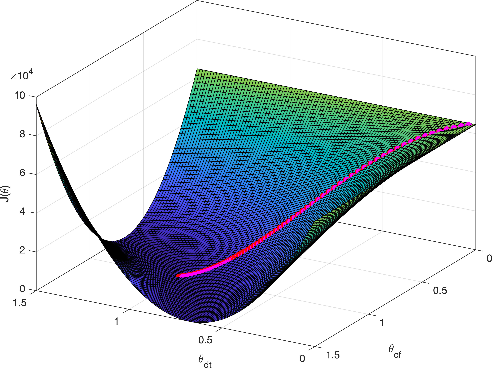

# drivetrain-efficiency

| Author(s) | Brief Description | Intended Uses and Known Limitations | Included Material | Updated |
|-|-|-|-|-|
| Ross Wilkinson, Ph.D. | Fits linear regression parameters for drievtrain efficiency and power meter accuracy to calculated and measured power outputs using gradient descent. | Compare mechanical efficiency between different drivetrain components and the accuracy of different power meters. Cost function is specific to testing two drivetrains and two power meters at two different power outputs. |  Dataset, MATLAB functions, and processing script | March 4, 2020 |

## Example

Simply run 'linearRegressionMulti.m' which calls a cost function and gradient descent algorithm to solve the parameters for drivetrain efficiency and power meter accuracy using the data table in 'data.m'.

The dataset compares two drive trains and two power meters tested at a measured power output of ~175 W and ~325 W. A rider completed two bouts of treadmill cycling for 30 sec at each power output.
